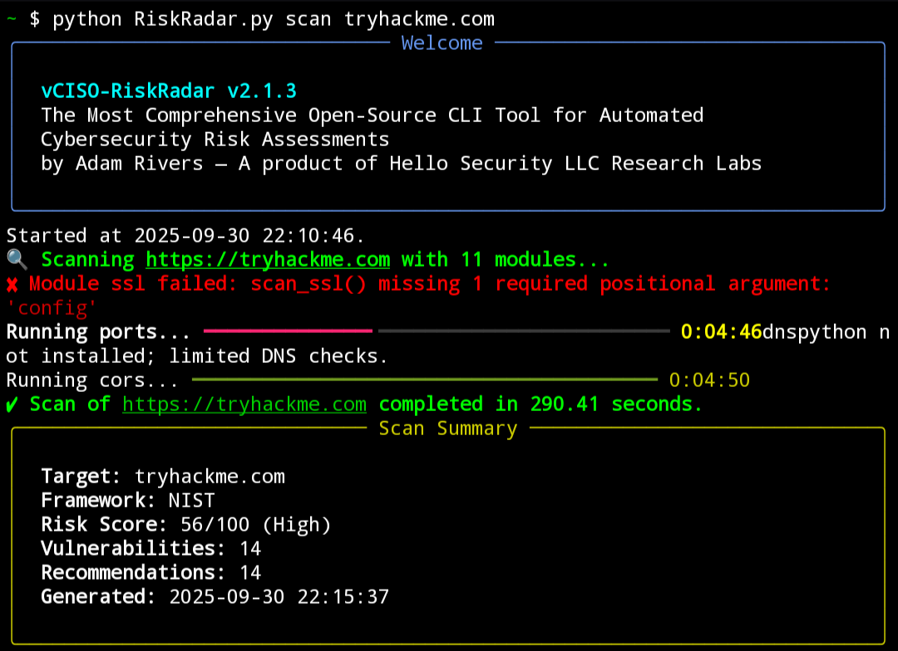
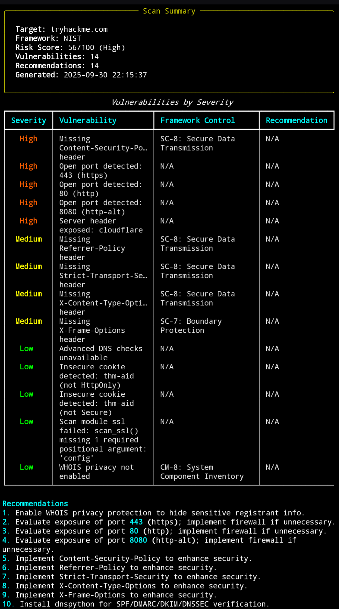

# vCISO-RiskRadar

**The Most Comprehensive Open-Source CLI Tool for Automated Cybersecurity Risk Assessments**

**Version**: 2.1.3  
**Author**: Adam Rivers — A product of Hello Security LLC Research Labs  
**License**: MIT License  
**Repository**: [https://github.com/AdamRiversCEO/vCISO-RiskRadar](https://github.com/AdamRiversCEO/vCISO-RiskRadar)

---

## Overview

vCISO-RiskRadar is a powerful, extensible command-line tool designed to perform automated cybersecurity risk assessments. It scans web targets for vulnerabilities, maps findings to compliance frameworks (e.g., NIST, ISO 27001, GDPR, PCI-DSS, HIPAA, CMMC), and generates detailed reports in multiple formats (Markdown, HTML, JSON, CSV). The tool supports modular scans, customizable configurations, and a sleek console interface powered by the `rich` library.

### Key Features

- **Comprehensive Scans**: Checks for HTTP headers, SSL/TLS, open ports, DNS records, WHOIS privacy, directory listings, cookies, CORS, and more.
- **Compliance Mapping**: Aligns vulnerabilities to controls in NIST, ISO 27001, GDPR, PCI-DSS, HIPAA, and CMMC frameworks.
- **Risk Scoring**: Calculates a weighted risk score (0-100) based on severity (Critical=10, High=7, Medium=4, Low=1).
- **Multi-Format Reports**: Generates reports in Markdown, HTML, JSON, and CSV, with customizable output.
- **Batch Scanning**: Supports scanning multiple targets defined in the configuration.
- **Enhanced Console UI**: Uses the `rich` library for styled output, including progress bars, tables, panels, and Markdown rendering.
- **Extensible**: Easily add new scan modules, frameworks, or configurations.
- **Non-Intrusive**: Designed for safe, permission-based scans with retry logic and timeouts.

---

## Screenshots

Below are example screenshots of vCISO-RiskRadar's console interface with the `rich` library:


*Screenshot 1: Displaying the scan progress bar and summary panel with color-coded risk score.*


*Screenshot 2: Showing the vulnerabilities table and rendered Markdown report in the console.*

---

## Installation

### Prerequisites

- **Python**: 3.6 or higher
- **Dependencies**:
  - Required: `requests`
  - Optional (for full functionality):
    - `markdown` (for HTML report generation)
    - `dnspython` (for advanced DNS checks like SPF, DMARC, DKIM, DNSSEC)
    - `rich` (for enhanced console UI with progress bars, tables, and styled output)

### Install Dependencies

```bash
pip install requests markdown dnspython rich
```

### Clone the Repository

```bash
git clone https://github.com/AdamRiversCEO/vCISO-RiskRadar.git
cd vCISO-RiskRadar
```

### Verify Installation

Run the help command to confirm the tool is set up correctly:

```bash
python RiskRadar.py --help
```

If `rich` is installed, you'll see a styled welcome panel; otherwise, standard console output is used.

---

## Usage

vCISO-RiskRadar supports four main commands: `scan`, `batch`, `config`, and `report`. Below are examples and details for each.

### Commands

#### 1. `scan`: Scan a single target

```bash
python RiskRadar.py scan https://example.com --framework NIST --output all --verbose
```

- **Arguments**:
  - `target`: URL or hostname (e.g., `https://example.com` or `example.com`).
  - `--framework`: Compliance framework (NIST, ISO 27001, GDPR, PCI-DSS, HIPAA, CMMC). Default: NIST.
  - `--output`: Report format (md, html, json, csv, all). Default: md.
  - `--verbose`: Enable debug logging.

- **Output**:
  - Console: Summary panel, vulnerabilities table, recommendations list, and full Markdown report (styled with `rich` if available).
  - Files: Reports saved in the `reports/` directory (e.g., `report_https_example.com_NIST_20250930_221158.md`).

#### 2. `batch`: Scan all configured targets

```bash
python RiskRadar.py batch --framework HIPAA --output json
```

- **Arguments**:
  - `--framework`: Compliance framework.
  - `--output`: Report format.
  - `--verbose`: Enable debug logging.

- **Output**: Similar to `scan`, but for each target in `config.json`.

#### 3. `config`: Manage configuration settings

```bash
python RiskRadar.py config --add-target https://example.com --add-module cors --set-timeout 10
```

- **Options**:
  - `--add-target <url>`: Add a scan target.
  - `--remove-target <url>`: Remove a scan target.
  - `--list-targets`: List all scan targets.
  - `--clear-targets`: Clear all scan targets.
  - `--set-timeout <seconds>`: Set scan timeout (positive integer).
  - `--set-retries <count>`: Set retry attempts (non-negative integer).
  - `--add-port <port>`: Add a port to scan (1-65535).
  - `--remove-port <port>`: Remove a port.
  - `--list-ports`: List default ports.
  - `--reset-ports`: Reset ports to default.
  - `--add-module <module>`: Add a scan module (e.g., `cors`, `ssl`).
  - `--remove-module <module>`: Remove a scan module.
  - `--list-modules`: List active scan modules.
  - `--reset-modules`: Reset modules to default.
  - `--list-frameworks`: List supported frameworks.
  - `--reset`: Reset entire config to default.

- **Output**: Styled tables or logs for listing actions; confirmation messages for modifications.

#### 4. `report`: Manage generated reports

```bash
python RiskRadar.py report --list
```

- **Options**:
  - `--list`: List all generated reports.
  - `--last`: Display the most recent report.
  - `--clean`: Delete all reports.
  - `--export <filename>`: Display a specific report (e.g., `report_https_example.com_NIST_20250930_221158.md`).

- **Output**: Styled tables or Markdown-rendered reports in the console.

### Example Workflow

1. Add a target and configure settings:
   ```bash
   python RiskRadar.py config --add-target https://example.com --add-port 8443 --set-retries 3
   ```

2. Run a scan:
   ```bash
   python RiskRadar.py scan https://example.com --framework PCI-DSS --output all --verbose
   ```

3. View the last report:
   ```bash
   python RiskRadar.py report --last
   ```

### Enhanced Console UI

With the `rich` library installed, vCISO-RiskRadar provides a sleek terminal interface:
- **Welcome Panel**: Displays version, author, and project info on startup.
- **Progress Bar**: Shows real-time scan progress with elapsed time during module execution.
- **Summary Panel**: Presents target, framework, risk score, and counts with dynamic border colors (green for low risk, yellow for medium, red for high/critical).
- **Vulnerabilities Table**: Color-coded severity (critical=red, high=orange, medium=yellow, low=green) with framework controls and recommendations.
- **Recommendations List**: Numbered list with cyan styling.
- **Report Display**: Renders Markdown reports in the console with proper formatting.
- **Config/Report Outputs**: Uses tables for listing targets, ports, modules, frameworks, and reports.

Without `rich`, the tool falls back to standard logging and text output.

---

## Configuration

The tool uses a `config.json` file for persistent settings. If not present, a default configuration is created automatically.

### Default Configuration

```json
{
    "frameworks": ["NIST", "ISO 27001", "GDPR", "PCI-DSS", "HIPAA", "CMMC"],
    "scan_targets": [],
    "default_ports": [20, 21, 22, 23, 25, 53, 80, 110, 143, 443, 465, 587, 993, 995, 3389, 5900, 8080],
    "timeout": 5,
    "user_agent": "vCISO-RiskRadar/2.1.3 (+https://github.com/AdamRiversCEO/vCISO-RiskRadar)",
    "risk_levels": {
        "critical": ["Expired SSL certificate", "DNS resolution failed", "Weak TLS version detected", "Potential header injection vulnerability"],
        "high": ["Server header exposed", "Missing Content-Security-Policy header", "Open port detected", "Weak SSL cipher detected", "Weak HTTP methods enabled", "Outdated software detected", "Directory listing enabled", "Too many redirects"],
        "medium": ["Missing X-Frame-Options header", "Missing Strict-Transport-Security header", "Missing X-Content-Type-Options header", "Missing Referrer-Policy header", "SSL certificate expires soon", "Robots.txt exposes sensitive paths", "Sitemap exposes sensitive paths", "Missing SPF record", "Missing DMARC record", "Missing DKIM record", "Insecure cookies detected", "CORS misconfiguration detected"],
        "low": ["No DNSSEC enabled", "WHOIS privacy not enabled"]
    },
    "scan_modules": ["http_headers", "http_methods", "robots_txt", "sitemap", "ports", "ssl", "dns", "whois", "directory_listing", "cookies", "cors"],
    "max_redirects": 5,
    "whois_servers": {"com": "whois.verisign-grs.com", "net": "whois.verisign-grs.com", "org": "whois.pir.org"},
    "outdated_software": {
        "Apache/2.2": "Apache < 2.4",
        "Apache/2.4.0": "Apache < 2.4.10",
        "IIS/7.5": "IIS < 8.0",
        "nginx/1.14": "nginx < 1.16"
    },
    "sensitive_paths": ["admin", "login", "backup", "config", "db", "api", "private", "internal", "wp-admin", ".git"],
    "retry_attempts": 2,
    "retry_delay": 1
}
```

### Modifying Configuration

Use the `config` command to update settings (e.g., add targets, ports, or modules). Changes are saved to `config.json`. To reset to default:

```bash
python RiskRadar.py config --reset
```

---

## Scan Modules

The tool includes the following scan modules:
- **http_headers**: Checks for missing security headers, server exposure, outdated software, and header injection risks.
- **http_methods**: Identifies unsafe HTTP methods (e.g., TRACE, DELETE).
- **robots_txt**: Detects sensitive paths exposed in robots.txt.
- **sitemap**: Checks for sensitive URLs in sitemap.xml.
- **ports**: Scans for open ports and outdated software banners.
- **ssl**: Validates SSL/TLS certificates, ciphers, and protocols.
- **dns**: Verifies SPF, DMARC, DKIM, and DNSSEC (requires `dnspython`).
- **whois**: Checks for WHOIS privacy protection.
- **directory_listing**: Detects enabled directory listings.
- **cookies**: Identifies insecure cookies (missing Secure or HttpOnly flags).
- **cors**: Detects CORS misconfigurations.

New modules can be added by extending the `SCAN_FUNCTIONS` dictionary in `RiskRadar.py`.

---

## Report Formats

Reports are saved in the `reports/` directory with filenames like `report_<target>_<framework>_<timestamp>.<format>`. Supported formats:
- **Markdown (md)**: Human-readable with structured sections.
- **HTML**: Styled web page (requires `markdown`).
- **JSON**: Machine-readable with full results.
- **CSV**: Tabular data for vulnerabilities.

Example report structure:
- **Executive Summary**: Target, framework, risk score, and counts.
- **Vulnerabilities by Severity**: Categorized by critical, high, medium, low.
- **Recommendations**: Actionable remediation steps.
- **Methodology**: Scan details and configuration.
- **Notes**: Usage tips and legal disclaimers.

---

## Logging

Logs are written to `riskradar.log` with timestamps and levels (INFO or DEBUG with `--verbose`). Example:

```plaintext
2025-09-30 22:11:58,123 - INFO - vCISO-RiskRadar v2.1.3 started at 2025-09-30 22:11:58.
2025-09-30 22:12:00,456 - DEBUG - Running module http_headers on https://example.com
```

---

## Contributing

Contributions are welcome! To add new features (e.g., modules, frameworks):
1. Fork the repository.
2. Create a branch (`git checkout -b feature/new-module`).
3. Add your module to `SCAN_FUNCTIONS` and update `RISK_LEVELS` or `FRAMEWORK_MAPPINGS` as needed.
4. Test thoroughly with `--verbose`.
5. Submit a pull request with a clear description.

Please follow the [Code of Conduct](CODE_OF_CONDUCT.md) and include tests for new features.

---

## Legal Disclaimer

vCISO-RiskRadar is designed for authorized security testing only. **Always obtain explicit permission from the target system's owner before scanning**. Unauthorized scanning may violate laws or terms of service. The author and Hello Security LLC are not responsible for misuse.

---

## Support

For issues, feature requests, or questions:
- Open an issue on [GitHub](https://github.com/AdamRiversCEO/vCISO-RiskRadar/issues).
- Contact Adam Rivers via [Hello Security LLC](https://hellosecurity.llc).

---

## License

This project is licensed under the MIT License. See [LICENSE](LICENSE) for details.

---

**vCISO-RiskRadar**: Empowering secure systems through automated risk assessment. Built with ❤️ by Adam Rivers.
```
